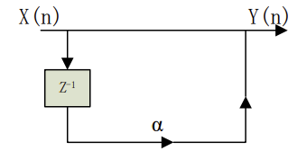

# 简单回声的产生
回声是有原始信号衰减后的多个延迟叠加而组成。回声用信号处理的延迟单元来生成。 $x(n)$ 表示原始声音信号， $y(n)$ 表示叠加后的声音信号。则原始信号和它延迟了 R 个间隔的单
个回声可以用如下差分方程表示：
$$y(n) = x(n) + \alpha (n − R) \qquad |\alpha|<1 \tag{1}$$
$\alpha$ 表示回声的衰减系数。上述差分方程也可以用系统函数表示为：
$$H(z) = 1 + \alpha z^{−R} \tag{2}$$
实际上是一个梳状滤波器



实验环境选用 MATLAB 或者 Python 都可以。  
## 一、用 MATLAB 进行试验
1. 采样量化。使用 matlab 的 `audiorecorder` 函数录制一段一定采样频率的语音数据。画出
语音信号波形，横轴标注为时间“t(s)”，纵轴为”幅度”。
2. 对录制语音信号降低一倍采样率，进行抽取，画出抽取后的信号波形，横轴标注为时间
“t(s)”， 纵轴为”幅度”，播放降低采样率后的语音信号。
3. 设回声延迟为 0.4 秒，回声衰减 60%，即 α=0.4；
4. 通过 matlab 编程，实现回声信号（两种方式 a,b）。
    1. 直接利用公式 1 实现
    2. 采用 filter 函数实现

## 二、用 python 来实现
也可以用 python 来实现，通过 Python 工具库 `pyaudio`，调用本地麦克风阵列实现音频的录
制。可参考下面的程序（参数需要自己设置）：

环境：  
mport wave Python3.7  
PyAudio

```python
from pyaudio import PyAudio,paInt16
framerate=16000 # 帧速率
NUM_SAMPLES=2000 #每个缓冲区的帧数
channels=1 # 声道
sampwidth=2 # 设置样本宽度
TIME=5 # 录制时长
def save_wave_file(filename,data): 
    with wave.open(filename,'wb') as wf: # 打开文件
        wf.setnchannels(channels) # 设置声道数量
        wf.setsampwidth(sampwidth) # 设置样本宽度
        wf.setframerate(framerate) # 设置帧速率
        wf.writeframes(b"".join(data)) 
def my_record(filename):
    pa=PyAudio() 
    stream=pa.open(format = paInt16,channels=1, # 创建
                    rate=framerate,input=True,
                    frames_per_buffer=NUM_SAMPLES)
    my_buf=[]
    count=0
    while count<TIME*8:#控制录音时间
        string_audio_data = stream.read(NUM_SAMPLES)
        my_buf.append(string_audio_data)
        count+=1
        print('.',end="")
        save_wave_file(filename+".wav",my_buf)
stream.close()
my_record("test")
```

## 成果


